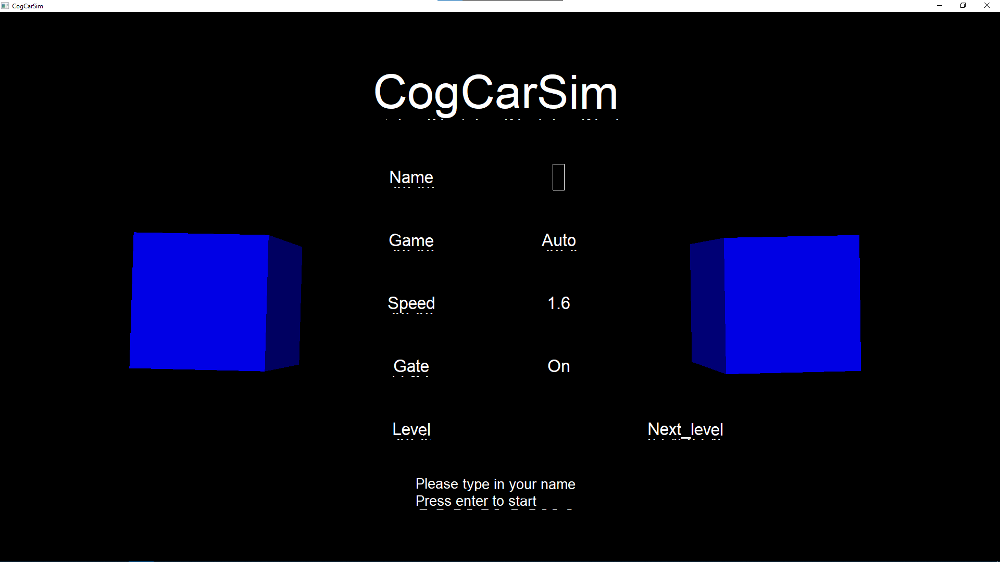
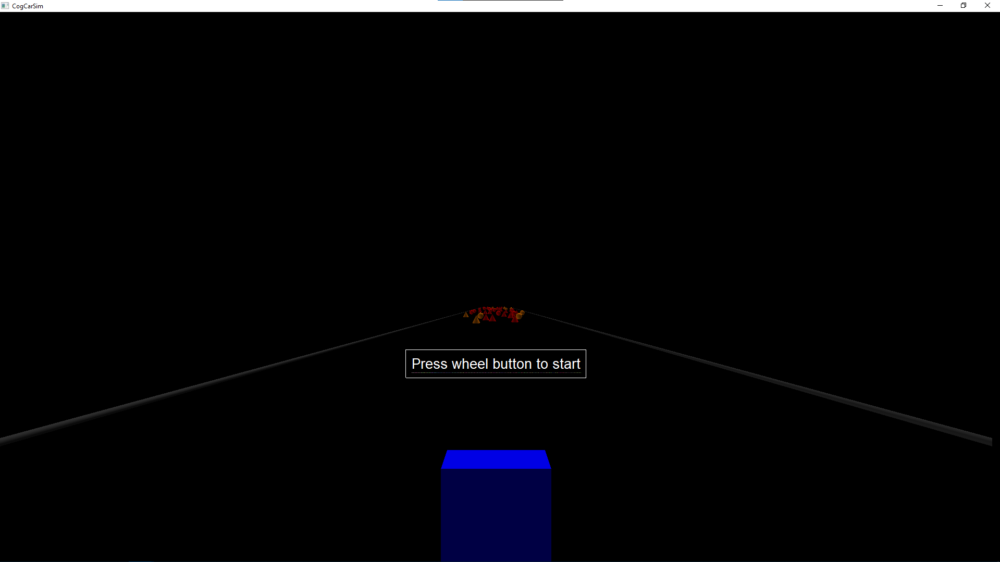

# CogCarSim (University of Helsinki)

## Requirements:
* VPython for Python 2. Can be download via https://vpython.org/contents/download_windows.html (must be 32-bit version due to compatibility problems)
* Python 2.7.x (must be 32-bit version).
* Install the VPython package to site-packages folder in Python 2 folder in your local machine.
* Logitech Gaming Steering Wheel

## Usage:

1. Clone the repository:
```
git clone git@github.com:Quan96/CogCarSim.git
```

2. Go to the folder where you save the repository

3. Right-click -> Powershell (Windows Terminal) -> Open here or Open the folder in IDE then using terminal
```
cd cogcarsim/
py -2 main.py
```

## Interface:



* Use Up and Down arrow to choose between fields

* Fill in your name (maximum 20 characters)

* Use the right-arrow to turn the in game speed gate on or off

* Choose levels (current 1-3) or leave it blank for randomly generated map

* After 1 game, you can choose to stop, choose the same or another map or got to next level

## In game:



* Using steering wheel to avoid obstacles

* If you choose to use the speed gate, there will be some gate on the way, whenever you passed a gate, your speed will change according the the pre-defined speed. If not, the speed will increase gradually and decrease if you hit obstacles.

### Shortcuts:

* "d" for debug information

* "a" for autopilot mode

* "p" for pause/resume
